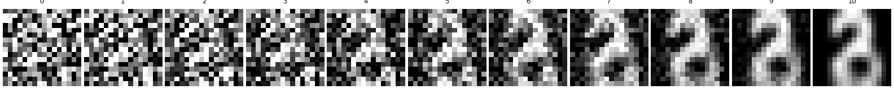
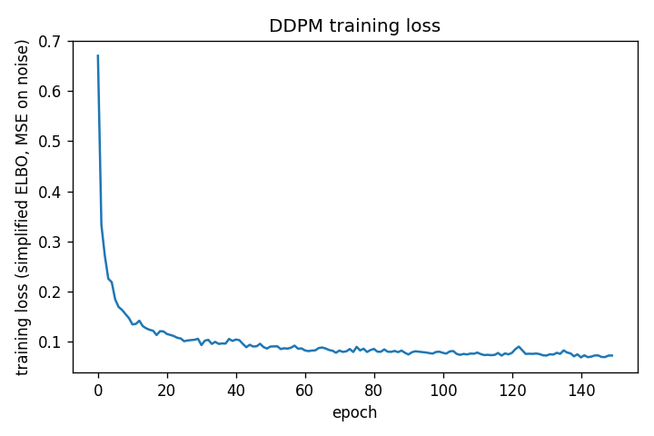
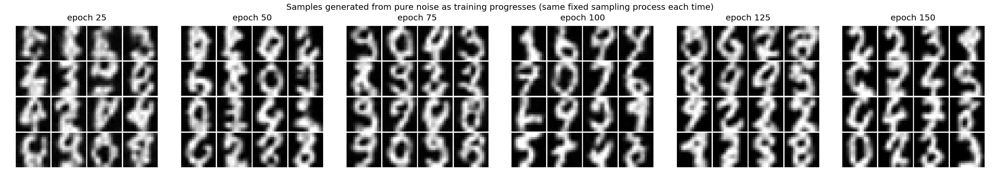

# DDPM from Scratch — Denoising Diffusion Probabilistic Models

A from-scratch PyTorch reproduction of **Ho, Jain & Abbeel, "Denoising Diffusion Probabilistic
Models" (2020)** — the paper behind modern image diffusion models (Stable Diffusion, Imagen,
DALL-E 2's diffusion decoder all descend from this). Every piece — the noise schedule, the
forward/reverse process math, the UNet, the training loop, and the sampler — is implemented
here directly from the paper's equations, not imported from a diffusers library.

This is a genuinely harder reproduction than a ResNet classifier: instead of one forward pass
and a cross-entropy loss, you have to get a *stochastic process* right (a Markov chain of T
noising steps and its learned reverse), derive the training objective from a variational bound,
and implement an iterative sampler that has to run correctly hundreds of times per image.

## What's actually implemented

| Paper concept | Where it lives |
|---|---|
| Forward diffusion `q(x_t \| x_0)` in closed form (reparameterization trick) | `diffusion.py: q_sample` |
| Linear beta noise schedule, `alpha_t`, `alpha_bar_t` | `diffusion.py: GaussianDiffusion.__init__` |
| Simplified training objective `L_simple` (Eq. 14): predict the noise, not the image | `diffusion.py: training_loss` |
| Reverse process / ancestral sampler (Eq. 11), `x_{t-1}` from `x_t` and predicted noise | `diffusion.py: sample` |
| UNet noise-prediction network with residual blocks + GroupNorm/SiLU | `model.py: UNet`, `ResBlock` |
| Sinusoidal timestep embedding (same construction as Transformer positional encoding) | `model.py: sinusoidal_embedding` |
| Self-attention at the bottleneck resolution | `model.py: SelfAttention` |

## Honest scope / what's scaled down and why

This runs on a **single CPU core**, no GPU, in one sitting — not on the paper's TPU pods over
days. To make that possible while still training-to-completion (not just "code that would
theoretically work"), I scaled the *size*, not the *method*:

- **Dataset**: the paper uses CIFAR-10 / CelebA-HQ / LSUN. Those require downloading tens of
  thousands of images, which this sandboxed environment can't reach (no route to the usual
  mirrors). Instead I used **scikit-learn's bundled UCI digits dataset** — 1,797 real
  handwritten-digit scans, no download required, upsampled from 8x8 to 16x16.
- **Image size**: 16x16 grayscale instead of 32x32 RGB.
- **Timesteps**: T=150 instead of T=1000 (still a real Markov chain with a real linear
  schedule — just a shorter one).
- **UNet width**: ~557K parameters, base channel width 32, two resolution levels + bottleneck,
  instead of the paper's much wider/deeper network.

None of these are shortcuts in the *algorithm* — the forward process, the loss derivation, and
the sampler are the full thing. They're compute shortcuts, the same way you'd reasonably scale
down before scaling up on real hardware.

## Results

Actual run: 150 epochs, single CPU core, ~11.5 minutes wall clock.

**Training loss** dropped from 0.670 (epoch 1) to 0.072 (epoch 150) and plateaued around
epoch ~100 — the expected curve shape for the noise-prediction MSE objective (`loss_curve.png`).

**`training_progression.png`** — the real proof this works: the *same* fixed sampling
procedure (start from pure Gaussian noise, run all 150 reverse steps) applied to the model's
weights at six different points in training. Epoch-25 samples are close to unstructured noise;
by epoch 150 the model has learned to turn pure noise into digit-like strokes.

**`samples/denoising_trajectory.png`** — a single generated sample shown at ~10 points along
its reverse trajectory from `x_T` (pure noise) to `x_0`, i.e. the denoising actually happening
step by step, not just before/after.

**`samples/epoch_0025.png` ... `epoch_0150.png`** — the individual full-resolution 4x4 grids
behind the progression figure above.

## Files

```
model.py       UNet architecture
diffusion.py   noise schedule, forward process, loss, sampler
data.py        dataset loading/preprocessing
train.py       training loop + sample/plot generation
outputs/       loss curve, sample grids, trajectory image, trained weights (model.pt)
```

## Running it yourself

```bash
python3 train.py --epochs 150 --batch_size 128 --timesteps 150 --img_size 16
```
On one CPU core this takes roughly 15-20 minutes. Swap `data.py` for a real MNIST/CIFAR loader
(e.g. `torchvision.datasets.MNIST`) and bump `--img_size` to run this at paper-scale on a
machine with GPU + internet access — no other code changes needed.

## Results

### Denoising Trajectory


### Loss Curve


### Training Progression

